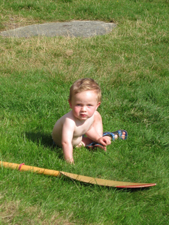

# matlab-inpainting
MATLAB Project - Object Inpainting

### how to execute the program
- in matlab command window: $ mex bestexemplarhelper.c
- open "LS1706203_Project.m" file and run
### example
original image vs. inpainting image  

